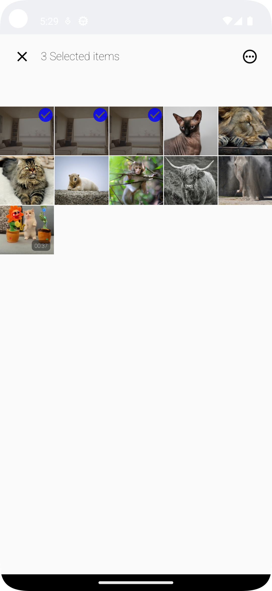

<h1 align="left"> Cloud Castle Android</h1>

Cloud Castle is an Android app that connects to the [`Cloud-Castle-API`](https://github.com/BBlueCoder/Cloud-Castle-API), providing efficient file retrieval and management capabilities. This app serves as a full-fledged cloud storage solution, developed using the latest Android development practices and trends.

Key Features:  
📂 **File Management**: Easily browse, search, and organize your files with an intuitive user interface.  
📤 **File Uploads**: Upload new files directly from your smartphone, making sharing and storage a breeze.  
☁️ **Cloud Storage**: Experience the convenience of cloud storage with secure access to your data at all times.  

What Sets Cloud Castle Apart:  
🚀 **Top-Tier Android Development**: Crafted following the latest trends and best practices in Android development.  
🔧 **Advanced Libraries**: Implementation of various Android Jetpack libraries for optimal performance.  
🏛️ **Clean Architectures and SOLID Principles**: Ensuring robust, maintainable code that evolves with your needs.  
🔍 **Scalable and Testable**: A future-proof design that can grow with your demands and is easily testable.  
🔄 **Continuous Integration**: Utilizes GitHub Actions for seamless updates and reliable performance.  
📆 **Always Up-to-Date**: Count on us to keep Cloud Castle maintained and up-to-date, adapting to the ever-changing Android ecosystem.  

## Application's UI
Cloud Castle's UI is simple and elegant. The app's UI is built using [jetpack compose](https://developer.android.com/jetpack/compose) and [Material Design 3](https://m3.material.io/). For navigation it implements the [Navigation component](https://developer.android.com/jetpack/compose/navigation) library for `jetpack compose`.

  
  
  

## Tech-Stack
Cloud Castle implements the latest trend libraries and best practices in android ecosystem. 

* Tech-Stack
  *  [Kotlin](https://developer.android.com/kotlin/first)
  *  [Jetpack Compose](https://developer.android.com/jetpack/compose)
  *  [Coroutines](https://developer.android.com/kotlin/coroutines)
  *  [Flow](https://developer.android.com/kotlin/flow)
  *  [WorkManager](https://developer.android.com/guide/background/persistent/getting-started)
  *  [Navigating with Compose](https://developer.android.com/jetpack/compose/navigation)
  *  [Material Design 3](https://m3.material.io/)
  *  [Hilt](https://developer.android.com/training/dependency-injection/hilt-android)
  *  [Retrofit](https://square.github.io/retrofit/)
  *  [Coil](https://github.com/coil-kt/coil)
  *  [Media3](https://developer.android.com/guide/topics/media/media3)
  *  [Mockk](https://mockk.io/)
  *  [JUnit4](https://junit.org/junit4/)
  *  [Konsist](https://docs.konsist.lemonappdev.com/)
 
## Project's Structure
All the packages reside in the app package except `konsist_test` package. 

The `data` and `ui` packages are layer components of `clean architecture`, the other 3 packages are non-layer components:
*  **di**: This package contains a [Hilt Module](https://developer.android.com/training/dependency-injection/hilt-android#hilt-modules) and other classes that are used in the hilt module.
*  **utils**: This package contains differents classes and objects that are used in the app.
*  **worker**: This package contains a [WorkManager](https://developer.android.com/guide/background/persistent/getting-started#define_the_work) class.

## Application's Architecture
Cloud Castle implements `MVVM Architecure` the [recommended app architecture](https://developer.android.com/topic/architecture#mobile-app-ux) from Android Developers team and `SOLID principles`, it is scalable and easy to test

 

The `data` and `ui` packages that mentioned above are layers of the MVVM architecture:
*  **data**: The data layer of an app contains the business logic. It is responsible for fetching data from the api through the repositories classes.
*  **ui**:  UI layer is responsible for displaying the data on the screen, it contains screens and `viewmodels`.

## CI
This projects uses [Github Actions](https://github.com/features/actions) to create a CI pipeline. With each push or pull request to the `main` branch the github actions run the workflow localed in [./github/workflows](https://github.com/BBlueCoder/Cloud-Castle-Android/blob/master/.github/workflows/main.yml)
The workflow contains various jobs:
*  `lint`: Checks project source files for potential bugs and optimization improvements for correctness, security, performance, usability, accessibility, and internationalization.
*  `konsist`: Konsist is a powerful static code analyzer tailored for Kotlin, focused on ensuring codebase consistency and adherence to coding conventions.
*  `unit-test`: Run unit tests.
*  `instrumentation-test`: Run instrumentation tests.
*  `build-debug-apk`: Build a debug apk.

## API Authentication
The Cloud Castle API endpoints require an authentication token for the user, the login and signup endpoints return a token that expires in 35 minutes. To improve the user experience the app's implements a mechanism 
to prevent the user login every 35 minutes as long as the app didn't close. There are two http interceptors, [`RequestInterceptor`](https://github.com/BBlueCoder/Cloud-Castle-Android/blob/master/app/src/main/java/com/bluecoder/cloudcastle/di/RequestInterceptor.kt)
and [`ResponseInterceptor`](https://github.com/BBlueCoder/Cloud-Castle-Android/blob/master/app/src/main/java/com/bluecoder/cloudcastle/di/ResponseInterceptor.kt)

*  `RequestInterceptor`: Intercepts every http request and add a token to the headers of the request.
*  `ResponseInterceptor`: Intercepts every response, if the response code is 401 that means the token is expired, log the user in again and resend the request with the new token.

## Feedback
We highly value your feedback as it helps us continually improve ViDown. Please don't hesitate to reach out to us with your comments, suggestions, or any issues you encounter while using the app.

## Contributing
Contributions are always welcome!
